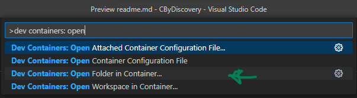

# C By Discovery
This repo follows along the textbook "C By Discovery" by L.S. Foster.

## Development and Testing
While you can absolutely compile and run the code locally if your environment is configured for C development, this repo is set up to use [VS Code Dev Containers](https://code.visualstudio.com/docs/devcontainers/containers) for development and testing.

If you feel like giving Dev Containers a try and don't already have it, install the [VS Code Dev Containers extension](https://marketplace.visualstudio.com/items?itemName=ms-vscode-remote.remote-containers)

### Using Dev Containers
1. Use the VS Code Command palette (ctrl+shift+p on Windows, cmd+shift+p on macOS) and enter "dev containers: open" and select "Open Folder in Container..." to open this repo in a container.
    - 
2. Change directory to desired chapter
    ```bash
    cd [chapter_dir]
    ```
3. Use gcc to compile a program
    ```bash
    gcc [program_name].c -o ../out/[program_name]
    ```
4. Execute the compiled program
    ```bash
    ../out/[program_name]
    ```

### Exiting Dev Containers


## Container Info
This repo's Dockerfile uses the latest [gcc image](https://hub.docker.com/_/gcc/) to compile and execute the code. All of the file contents are copied into the container for editing, compilation and execution, and then copied back to the local storage once done.
